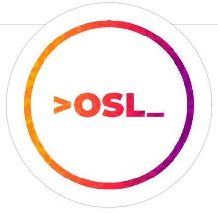

<h1 style="text-align: center; color: orange;">Open Source Day 2023</h1>

## Description
Welcome to the __Open Source Day 2023!__ This event aims to celebrate the spirit of open source software and promote collaboration within the developer community. Join us on May 22nd at __Vidyavardhaka College of Engineering__ for a day filled with insightful talks, workshops, and networking opportunities.

## Installation Instructions
To get started with the Open Source Day 2023 website, follow these steps:
1. Clone the repository: `git clone https://github.com/Asymmentric/osd-23.git`
2. Navigate to the project directory: `cd open-source-day-2023`
3. Install dependencies: `npm install`
4. Build the website: `npm run build`
5. Open the website in a web browser: `open index.html`

## Usage
The Open Source Day 2023 website provides the following features:
- View the event schedule and speaker lineup.
- Register for the event.
- Explore information about the venue and directions to reach there.
- Connect with other participants and engage in discussions.

## Technologies Used
The Open Source Day 2023 website is built using the following technologies and tools:
- _HTML5_
- _CSS3_
- _JavaScript_
- _Bootstrap_
- _Node.js_
- _Webpack_

## Contributing Guidelines
We appreciate contributions from the community. __To contribute to the Open Source Day 2023 website__, please follow these guidelines:
1. Fork the repository and create a new branch for your feature or bug fix.
2. Commit your changes with descriptive commit messages.
3. Push your branch to your forked repository.
4. Submit a pull request to the main repository, explaining the purpose and details of your contribution.

